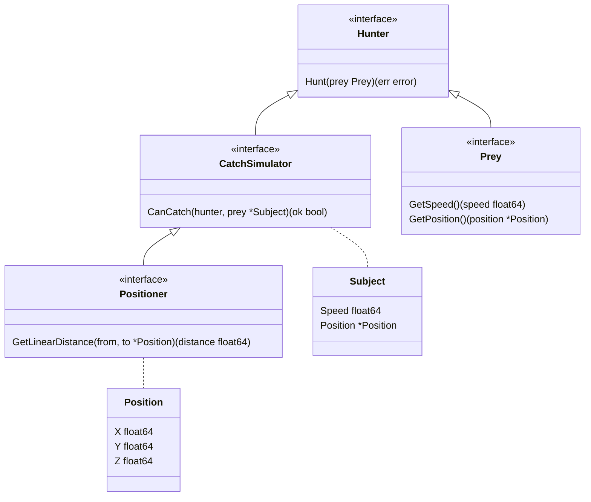

This is a diagram made on mermaid.js that represents the usage of interfaces in the project.

```mermaid
classDiagram
    %% Interfaces
    class Positioner {
        <<interface>>
        GetLinearDistance(from, to *Position) (distance float64)
    }
    class Position {
        X float64
        Y float64
        Z float64
    }


    class CatchSimulator {
        <<interface>>
        CanCatch(hunter, prey *Subject) (ok bool)
    }
    class Subject {
        Speed float64
        Position *Position
    }

    class Prey {
        <<interface>>
        GetSpeed() (speed float64)
        GetPosition() (position *Position)
    }

    class Hunter {
        <<interface>>
        Hunt(prey Prey) (err error)
    }

    %% Relations
    %% -> interface schemas
    Positioner .. Position
    CatchSimulator .. Subject

    %% -> consumption
    CatchSimulator <|-- Positioner

    Hunter <|-- Prey
    Hunter <|-- CatchSimulator
```